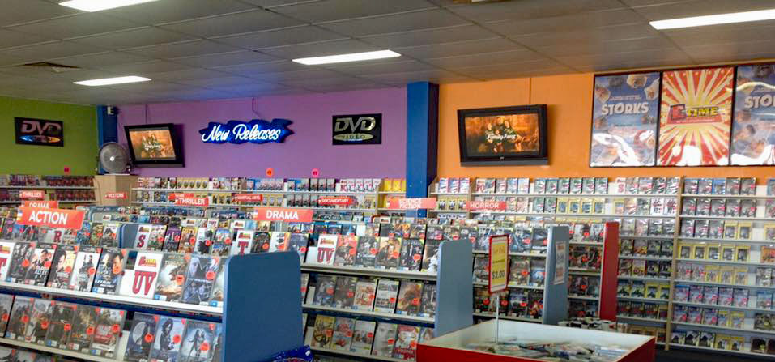

# Film-Rental-Store-Project-SQL

## Built with
### SQL Languages

* SQL
* PostgreSQL

### Tools

* pgAdmin

## Overview
In this project, I analyzed a movie rental database using SQL queries to gain insights into the films, customers, and transactions in the database. 
The database contains information about movies, actors, customers, rental transactions, and more. By writing SQL queries to answer a series of questions,
I was able to explore trends and patterns in the data and draw conclusions about the movie rental industry.

#3 Questions Explored
Using SQL, I wrote queries to answer questions such as:

* What is the lowest replacement cost of a movie in the database?
* How many movies have replacement costs in different price ranges (low, medium, high)?
* Which movie in the Drama or Sports category is the longest, and how long is it?
* What is the most common movie category in the database?
* Which actor appears in the most movies?
* How many addresses are not associated with any customer?
* What is the total sales for each city in the database?
* Which staff member makes the most revenue per customer on average?
* What is the average daily revenue on Sundays in the database?
* Which movies have a length and replacement cost above the average for their respective groups?
* What is the average lifetime value of customers in different districts?
* What is the total revenue and lowest payment ID for the Action movie category?
* What is the top-performing movie in the Animation category?

## Solutions

[Click Here](https://github.com/Shiva-teja-chary-andhoju/Film-Rental-Store-Project-SQL/blob/main/film%20rental%20store%20challenges%20and%20solutions.sql)

## Conclusion
Through the analysis of the movie rental database, several key insights were obtained. Firstly, the lowest replacement cost for a movie was $9.99, 
and over 500 movies had replacement costs in the low price range of $9.99 to $19.99. Secondly, the Sports category had the most movies with 74 titles, 
while Susan Davis appeared in the most movies with 54 appearances. Thirdly, the city of Cape Coral had the highest total sales with $221.55. Fourthly, 
the top-performing movie in the Animation category was Dogma Family with total revenue of $178.70.

Overall, this project demonstrates the power of SQL queries in analyzing large datasets to draw insights and conclusions. By applying SQL skills to a 
real-world scenario, I was able to build practical experience in data analysis and gained a deeper understanding of the movie rental industry.
